<div align="center">
  <a href="https://javiwarrior.com">
    
  </a>
</div>

## About

Hi, I'm **Javier** — also known as **JaviWarrior**. I'm a Software Analysis & Development Technologist building web and mobile products with a security-first mindset. Founder of [Latin Territory](https://latinterritory.com), a platform connecting the Latin community across Australia.

```ts
const javiWarrior = {
  location: "Brisbane, Australia",
  stack: ["Next.js", "TypeScript", "Flutter", "Supabase"],
  focus: ["Cybersecurity", "AI", "Clean Architecture"],
  currently: "Building Latin Territory 🌏",
  motto: "The best way to predict the future is to create it",
} as const;
```

## Stack

<table>
  <tr>
    <td><code>FRONTEND</code></td>
    <td>
      
      
      
      
    </td>
  </tr>
  <tr>
    <td><code>MOBILE</code></td>
    <td>
      
      
    </td>
  </tr>
  <tr>
    <td><code>BACKEND&nbsp;&amp;&nbsp;DATA</code></td>
    <td>
      
      
      
    </td>
  </tr>
  <tr>
    <td><code>SECURITY&nbsp;&amp;&nbsp;OPS</code></td>
    <td>
      
      
      
      
      
    </td>
  </tr>
</table>

## Featured

<table width="100%">
  <tr>
    <td>
      <h3>🌏 Latin Territory <sup><code>WEB + MOBILE</code></sup></h3>
      <p>Directory platform connecting Latin businesses, services and community across Australia — web app in Next.js/TypeScript, mobile app in Flutter, backed by Supabase.</p>
      <p><code>NEXT.JS</code> <code>TYPESCRIPT</code> <code>FLUTTER</code> <code>SUPABASE</code></p>
      <p>
        <a href="https://latinterritory.com">🔗 latinterritory.com</a> ·
        <a href="https://github.com/Javiko0420/plataforma-colombiana">📂 Web repo</a> ·
        <a href="https://github.com/Javiko0420/latinterritory-mobile">📱 Mobile repo</a>
      </p>
    </td>
  </tr>
</table>

<table width="100%">
  <tr>
    <td>⚔️ <a href="https://javiwarrior.com"><b>javiwarrior.com</b></a> — Personal site &amp; portfolio: projects, experiments and how to reach me.</td>
  </tr>
</table>

## Analytics

<div align="center">
  <a href="https://github.com/Javiko0420">
    
    
  </a>
</div>

## Connect

<p>
  <a href="https://javiwarrior.com"></a>
  <a href="https://www.linkedin.com/in/javier-felipe-guerrero-zambrano-8951282b/"></a>
  <a href="mailto:javiguerreroz86@gmail.com"></a>
</p>

---

<div align="center">
  
</div>
